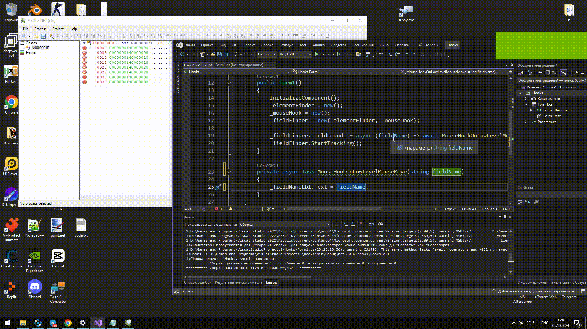

# ElementSpy



## Mini Code Documentation:

```csharp

    using ElementSpy;

    public partial class Form1 : Form
    {
        private AutomationElementFinder _elementFinder;

        private FieldFinder _fieldFinder;
        public Form1()
        {
            InitializeComponent();
            _elementFinder = new();
            _fieldFinder = new(_elementFinder);

            _fieldFinder.FieldFound += async (fieldName) => await MouseHookOnLowLevelMouseMove(fieldName);
            _fieldFinder.StartTracking();
        }

        private async Task MouseHookOnLowLevelMouseMove(string fieldName)
        {
            _fieldNameLbl.Text = fieldName;
        }
    }

```